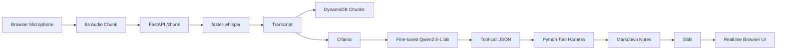
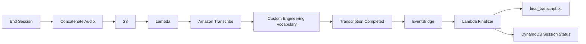

# 🎤 SpeechLekha

> **Real-time speech-to-structured notes for engineering lectures — fully self-hosted on AWS.**

SpeechLekha converts live spoken lectures into structured Markdown notes in real time. It combines browser audio capture, local speech-to-text, a fine-tuned small language model, an agent/tool harness, AWS storage, and an archival transcription pipeline.

The system is designed to run without OpenAI or other proprietary LLM APIs. Live transcription and note generation run on the EC2 instance, while AWS services handle storage, persistence, orchestration, and high-accuracy archival transcription.

---

## ✨ What SpeechLekha Does

SpeechLekha follows this pipeline:

```text
🎙️ Browser Microphone
        │
        │ 8-second audio chunks
        ▼
┌───────────────────────────────┐
│ AWS EC2                       │
│                               │
│ FastAPI                       │
│   ├── faster-whisper          │
│   │      ↓                    │
│   │   Live Transcript         │
│   │      ↓                    │
│   └── Ollama                  │
│          ↓                    │
│   Fine-tuned SpeechLekha SLM  │
│          ↓                    │
│   Tool-call JSON              │
│          ↓                    │
│   Markdown Note Files         │
└───────────────┬───────────────┘
                │
       ┌────────┴────────┐
       ▼                 ▼
   DynamoDB              S3
 Sessions / Chunks   Audio / Notes
                         │
                         ▼
                Amazon Transcribe
                Custom Math Vocabulary
                         │
                         ▼
                    EventBridge
                         │
                         ▼
                      Lambda
                         │
                         ▼
                final_transcript.txt

                Export
          ┌───────┼───────┐
          ▼       ▼       ▼
         .md    .docx    .pdf
```

---

## 🚀 Key Features

- 🎙️ **Live speech capture** from the browser microphone.
- ⏱️ Audio is processed in **8-second chunks**.
- 📝 **Live STT** using `faster-whisper` with the `tiny.en` model.
- 🧠 Fine-tuned **Qwen2.5-1.5B** model served locally through Ollama.
- 🤖 Agent-based note generation using structured JSON tool calls.
- 📚 Automatically creates structured Markdown sections.
- 🔗 Supports **Obsidian-style `[[wikilinks]]`**.
- 📊 Generates bullets, tables, paragraphs, and Mermaid diagrams.
- ⚡ Realtime UI updates using **Server-Sent Events (SSE)**.
- ☁️ Stores audio and notes in **Amazon S3**.
- 🗄️ Tracks sessions and chunks using **DynamoDB**.
- 🎯 Uses an **Amazon Transcribe custom engineering-math vocabulary** for archival transcription.
- ⚙️ Lambda + EventBridge finalize the archival transcription pipeline.
- 📄 Exports notes as **Markdown, DOCX, and PDF**.
- 🔒 Ollama remains localhost-only; port `11434` is not exposed.
- 💰 Designed for a low-cost demo deployment.

---

## 🧩 Technology Stack

| Layer | Technology |
|---|---|
| Frontend | HTML, JavaScript |
| Realtime Communication | Server-Sent Events (SSE) |
| Backend | FastAPI |
| Live STT | faster-whisper |
| Live STT Model | Whisper `tiny.en` |
| Agent Model | Fine-tuned Qwen2.5-1.5B |
| Model Runtime | Ollama |
| Cloud Compute | AWS EC2 |
| Object Storage | Amazon S3 |
| Database | Amazon DynamoDB |
| Archival STT | Amazon Transcribe |
| Serverless Processing | AWS Lambda |
| Event Orchestration | Amazon EventBridge |
| Access Control | AWS IAM |
| Monitoring / Budget | Amazon CloudWatch |
| Audio Processing | FFmpeg |
| Document Export | Pandoc + WeasyPrint |
| Model Hosting | Hugging Face |

---

## 🏗️ Architecture

### Live Processing



### Archival Processing



The implementation uses EC2/FastAPI for the live pipeline, S3 and DynamoDB for persistence, and Lambda/EventBridge/Amazon Transcribe for archival processing. fileciteturn0file1L8-L19

---

## 📁 Project Structure

A typical deployment contains:

```text
speechlekha/
│
├── app.py
├── lambda_function.py
├── create_vocab.py
├── bootstrap.sh
│
├── trust-ec2.json
├── speechlekha-ec2-policy.json
├── trust-lambda.json
├── speechlekha-lambda-policy.json
│
├── function.zip
├── speechlekha.pem
│
└── data/
    └── <session-id>/
        ├── 00-index.md
        ├── 01-*.md
        ├── 02-*.md
        ├── chunk_001.webm
        ├── chunk_002.webm
        ├── full.webm
        └── concat.txt
```

During runtime, the application stores generated note files under a session-specific directory and uploads changed notes to S3. fileciteturn0file1L224-L240

---

## 🔄 How It Works

### 1. Start a Session

The browser calls:

```http
POST /session
```

The server creates a 12-character session ID and initializes the session state.

### 2. Capture Audio

The browser requests microphone access and records audio in 8-second chunks.

```javascript
rec.start(8000);
```

Each chunk is uploaded to:

```http
POST /chunk/{session_id}
```

### 3. Live Transcription

`faster-whisper` processes each chunk locally on the EC2 CPU.

The implementation uses:

```text
Model: tiny.en
Device: CPU
Compute type: int8
```

Engineering-math hotwords and an initial prompt are used to improve recognition of domain terminology.

### 4. Generate Notes

After every configured number of chunks, the transcript is sent to the locally hosted SpeechLekha model through Ollama.

The model returns structured tool calls such as:

```json
{
  "tool_calls": [
    {
      "tool": "create_section",
      "args": {
        "title": "Eigenvalues"
      }
    }
  ]
}
```

Available tools include:

- `create_section`
- `append_bullets`
- `add_paragraph`
- `add_table`
- `add_mermaid`
- `update_index`
- `flag_confusion`

### 5. Render Notes in Real Time

The browser receives events through SSE:

```http
GET /stream/{session_id}
```

The UI renders the generated Markdown and Mermaid diagrams live.

### 6. End the Session

When the user clicks **End & Export**:

```http
POST /session/{session_id}/end
```

SpeechLekha:

1. Concatenates audio chunks.
2. Uploads `full.webm` to S3.
3. Creates `notes.zip`.
4. Invokes the archival Lambda.
5. Starts an Amazon Transcribe job.
6. Uses the custom engineering-math vocabulary.
7. EventBridge detects completion.
8. Lambda writes `final_transcript.txt`.
9. The session is marked `completed`.

---

## 🔌 API Endpoints

| Method | Endpoint | Purpose |
|---|---|---|
| `GET` | `/` | SpeechLekha web UI |
| `POST` | `/session` | Create a new lecture session |
| `POST` | `/chunk/{sid}` | Upload an audio chunk |
| `GET` | `/stream/{sid}` | Receive realtime SSE events |
| `GET` | `/files/{sid}` | Retrieve generated Markdown files |
| `POST` | `/session/{sid}/end` | End session and start archival processing |
| `GET` | `/export/{sid}?format=md` | Export Markdown |
| `GET` | `/export/{sid}?format=docx` | Export DOCX |
| `GET` | `/export/{sid}?format=pdf` | Export PDF |

The FastAPI application defines these session, chunk, streaming, file, end-session, and export routes. fileciteturn0file1L337-L424

---

## ☁️ AWS Infrastructure

SpeechLekha uses the following AWS resources:

```text
AWS Region: ap-south-1 (Mumbai)

EC2
 └── FastAPI + faster-whisper + Ollama

S3
 └── Audio
 └── Notes
 └── Transcription output

DynamoDB
 ├── Sessions
 └── Chunks

Lambda
 └── speechlekha-finalizer

EventBridge
 └── speechlekha-transcribe-done

IAM
 ├── speechlekha-ec2-role
 └── speechlekha-lambda-role

CloudWatch
 └── Budget / billing alarm
```

The project documentation specifies `ap-south-1` as the target region and uses S3, DynamoDB, IAM, Lambda, EventBridge, CloudWatch, EC2, and Amazon Transcribe. fileciteturn0file0L3-L5

---

## 🛠️ Prerequisites

Before deploying SpeechLekha, you need:

- AWS account with available credits.
- AWS CLI installed and configured.
- Python 3.x.
- Permission to create the required AWS resources.
- Public Hugging Face model repository:
  `Himanshu-Vishwakarma-HF/speechlekha-qwen-gguf`
- SSH access to the EC2 instance.
- A browser with microphone support.

Configure AWS:

```bash
aws configure
```

Set the region:

```bash
export AWS_DEFAULT_REGION=ap-south-1
```

Verify your AWS identity:

```bash
aws sts get-caller-identity
```

The deployment guide uses `ap-south-1` and derives the S3 bucket name from the AWS account ID. fileciteturn0file1L23-L37

---

## ⚙️ Deployment Overview

The deployment is organized into verification gates so that each infrastructure component is checked before moving to the next stage.

### Phase 0 — Environment Setup

- Configure AWS CLI.
- Configure credentials.
- Set AWS region.
- Verify AWS identity.

### Phase 1 — AWS Infrastructure

Create:

- CloudWatch billing safeguard.
- S3 bucket.
- DynamoDB tables.
- IAM roles.
- Lambda function.
- EventBridge rule.
- Amazon Transcribe custom vocabulary.

### Phase 2 — EC2 + Model Bootstrap

Create:

- EC2 key pair.
- Security group.
- EC2 instance.
- Swap space.
- FFmpeg.
- Pandoc.
- WeasyPrint.
- Python dependencies.
- Ollama.
- SpeechLekha model.
- Whisper model cache.

### Phase 3 — Application Deployment

Upload:

```bash
scp -i speechlekha.pem app.py ubuntu@"$IP":/opt/speechlekha/app.py
```

Start the service:

```bash
ssh -i speechlekha.pem ubuntu@"$IP" \
'sudo systemctl daemon-reload && sudo systemctl enable --now speechlekha'
```

### Phase 4 — Verification

Check:

```bash
curl -s "http://$IP/" | grep -o SpeechLekha
```

Create a session:

```bash
SID=$(curl -s -X POST "http://$IP/session" | \
python3 -c "import sys,json;print(json.load(sys.stdin)['session_id'])")
```

Inspect generated files:

```bash
curl -s "http://$IP/files/$SID"
```

### Phase 5 — Demo

Run the browser application and demonstrate:

```text
Start
  ↓
Speak engineering mathematics
  ↓
Live transcript
  ↓
Live Markdown notes
  ↓
Tables / Mermaid / Wikilinks
  ↓
End & Export
  ↓
Archival transcript + document exports
```

### Phase 6 — Teardown

After testing or the demo, terminate the AWS resources to prevent unnecessary charges.

The project execution checklist explicitly separates environment setup, infrastructure, archival STT, EC2 bootstrap, application testing, demo rehearsal, and teardown. fileciteturn0file0L9-L16

---

## 🎬 90-Second Demo

### 0:00 – 0:15 — Introduction

Show the SpeechLekha interface and explain that the live system runs self-hosted on AWS without calling OpenAI.

### 0:15 – 0:45 — Speak

Speak an engineering mathematics example such as:

> Eigenvalues satisfy the characteristic equation obtained from the determinant of A minus lambda I.

The live transcript should appear in the left panel.

### 0:45 – 1:15 — Show Note Generation

Show the right panel building:

- Sections
- Bullets
- Tables
- Mermaid diagrams
- `[[wikilinks]]`

### 1:15 – 1:30 — Archive & Export

Click **End & Export** and demonstrate:

- Final archival transcript.
- S3 output.
- Markdown export.
- DOCX export.
- PDF export.

The project demo guide defines this exact live-note and archival-export flow. fileciteturn0file1L668-L675

---

## 🔐 Security Considerations

- S3 public access blocking is enabled.
- Ollama runs on localhost and its port is not exposed publicly.
- SSH access can be restricted to the operator's IP.
- The EC2 instance uses an IAM instance profile rather than hard-coded AWS credentials.
- Lambda uses a dedicated IAM execution role.
- The application contains a path-jail check to prevent note-file path traversal.
- AWS resources should be deleted after the demo when they are no longer required.

The deployment guide specifically keeps Ollama's port `11434` localhost-only and exposes port 80 for the demo UI. fileciteturn0file1L141-L150

---

## 💰 Cost Awareness

The project is designed as a low-cost demo deployment, with the documentation estimating roughly:

```text
~$0.50 – $2.00 for a demo day
```

A CloudWatch billing safeguard is included with a `$10` threshold in the deployment instructions. fileciteturn0file0L35-L52

**Important:** AWS pricing can change, and actual cost depends on instance usage, storage, transcription duration, and other resource consumption. Always verify current AWS pricing before running a long-lived deployment.

---

## 🧪 Verification Checklist

Use this checklist before a demo:

```text
[ ] AWS credentials verified
[ ] S3 bucket available
[ ] DynamoDB Sessions table ACTIVE
[ ] DynamoDB Chunks table ACTIVE
[ ] IAM EC2 role ready
[ ] IAM Lambda role ready
[ ] Transcribe vocabulary READY
[ ] Lambda deployed
[ ] EventBridge rule configured
[ ] EC2 running
[ ] Ollama model available
[ ] Whisper model cached
[ ] FastAPI service running
[ ] Browser microphone permission granted
[ ] /session works
[ ] /chunk works
[ ] Live transcript appears
[ ] Agent generates Markdown
[ ] /files works
[ ] Session end uploads audio
[ ] Transcribe job completes
[ ] final_transcript.txt exists
[ ] Markdown export works
[ ] DOCX export works
[ ] PDF export works
[ ] AWS resources terminated after demo
```

---

## 🐛 Troubleshooting

### Ollama gets killed / runs out of memory

The deployment uses swap to reduce memory pressure. If the instance still cannot handle the model workload, a larger instance may be required.

### `/chunk` is slow

CPU-based `tiny.en` transcription is expected to take several seconds per chunk. Larger Whisper models will generally require more compute.

### Amazon Transcribe job fails

Check that:

1. The custom vocabulary is `READY`.
2. `full.webm` exists in S3.
3. The media file is valid.
4. The Lambda role has the required Transcribe permissions.

### `final_transcript.txt` does not appear

Check Lambda logs:

```bash
aws logs tail /aws/lambda/speechlekha-finalizer
```

Also verify that the EventBridge rule is receiving the Transcribe completion event.

### SSE does not update

Open browser developer tools and inspect the EventSource connection. The raw-IP demo is expected to use HTTP rather than HTTPS.

The project guide documents these troubleshooting cases, including Ollama memory pressure, Whisper latency, Transcribe failures, missing final transcripts, and SSE behavior. fileciteturn0file1L697-L707

---

## 🧹 Teardown

When the demo is finished, remove the AWS resources that were created for the deployment.

Example:

```bash
aws ec2 terminate-instances --instance-ids "$INSTANCE_ID"

aws ec2 delete-key-pair \
  --key-name speechlekha

aws dynamodb delete-table \
  --table-name Sessions

aws dynamodb delete-table \
  --table-name Chunks

aws s3 rb \
  "s3://${BUCKET}" \
  --force

aws lambda delete-function \
  --function-name speechlekha-finalizer

aws events delete-rule \
  --name speechlekha-transcribe-done
```

Also remove the IAM roles and instance profile after detaching their policies.

The project documentation explicitly recommends teardown after the demo to protect AWS credits. fileciteturn0file1L678-L693

---

## 🧠 Design Principles

SpeechLekha is built around a few important principles:

### Self-hosted intelligence

Live STT and note generation run on the EC2 machine instead of relying on an external proprietary LLM API.

### Structured notes instead of raw transcripts

The agent doesn't simply return a block of text. It uses tools to build a navigable Markdown knowledge base.

### Two-stage transcription

```text
Live:
faster-whisper
     ↓
Fast feedback

Archive:
Amazon Transcribe + custom vocabulary
     ↓
Higher-quality final transcript
```

### Cloud services where they make sense

AWS is used for:

- Compute
- Storage
- Persistence
- Serverless orchestration
- Archival transcription
- Monitoring

while the core live intelligence remains self-hosted.

---

## 📌 Current Project Status

The execution checklist tracks the deployment through six phases:

| Phase | Status |
|---|---|
| Environment Connection & CLI/CloudShell Setup | ✅ Completed |
| Cloud Infrastructure & Security Roles | ✅ Completed |
| Archival STT | ⬜ Pending |
| EC2 Launch & Automated Model Bootstrap | ✅ Completed |
| Application Wiring & E2E Testing | ⬜ Pending |
| Demo Rehearsal | ⬜ Pending |
| Clean Teardown | ⬜ Pending |

The current tracking document marks Phase 0, Phase 1, and the EC2 infrastructure steps as completed, while archival STT, end-to-end testing, demo rehearsal, and teardown remain verification milestones. fileciteturn0file0L9-L16 fileciteturn0file0L80-L100

---

## 🌟 Why SpeechLekha?

Traditional lecture recording gives you audio.

Traditional speech-to-text gives you a transcript.

SpeechLekha aims to give you a **living knowledge base**:

```text
Speech
  ↓
Transcript
  ↓
Structured Notes
  ↓
Sections
  ↓
Tables
  ↓
Diagrams
  ↓
Linked Concepts
  ↓
Exportable Knowledge
```

The goal is to make spoken technical content immediately useful, searchable, structured, and reusable.

---

## 📄 License

No license is specified in the provided project documentation.

If this repository is intended to be public, add an explicit license before others reuse or redistribute the code.

---

## 👨‍💻 Project

**SpeechLekha**  
Real-time speech-to-structured lecture notes using self-hosted AI and AWS infrastructure.

